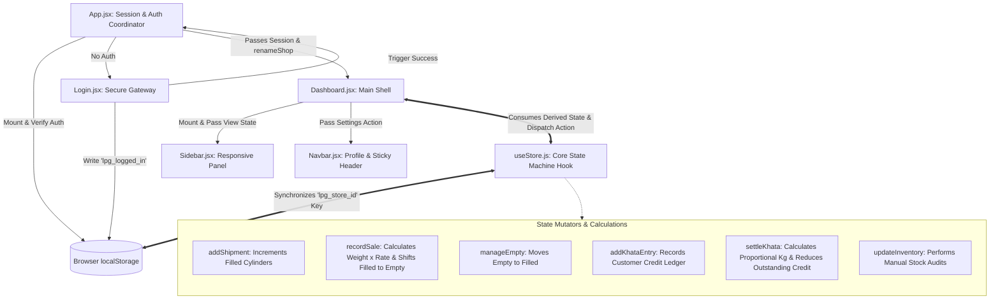

# 🔥 Smart LPG Store

[](https://react.dev/)
[](https://vite.dev/)
[](https://tailwindcss.com/)
[](https://www.radix-ui.com/)
[](https://lucide.dev/)

A premium, state-of-the-art single-store LPG gas cylinder distribution management system. Engineered as a highly performant, visually gorgeous Single Page Application (SPA), it provides shop owners and administrators with real-time controls over inventory, cylinder shipments, customer credit ledgers (Khata Book), and visual sales analytics under an immersive glassmorphism layout.

---

## ✨ Immersive Design & Core Features

*   **🌌 Hyper-Premium Aesthetics:** Implements a state-of-the-art dark interface inspired by modern gaming dashboards, utilizing dynamic HSL-tailored colors, smooth gradients, dynamic backdrop filters, and custom micro-animations (like float-slow and shimmer overlays).
*   **📦 Cylinder Inventory Operations:** Direct tracking of filled vs. empty cylinders (preset with standard 45kg commercial cylinders). Features visual gauges showing full-to-empty ratios and instant inventory refilling routines.
*   **⚖️ Dynamic Per-Kg Rate Control:** Fully editable gas rate per kg with real-time propagation. Sale amounts for massive 45kg cylinders are automatically calculated on the fly.
*   **📖 Integrated Khata Book (Udhar Ledger):** Advanced customer credit book recording credits in terms of kg weights. Payments are settled in PKR, and the system automatically calculates the exact proportional kg amount cleared based on historical rate valuations. Includes a 30-day payment history.
*   **📊 Live Analytical Reports:** Real-time business intelligence dashboard displaying Today's Sales Value, Weekly Sales Aggregates, and transaction counts. Features an elegant custom Weekly Sales Bar Chart.
*   **🛡️ Multi-Shop Sandboxing & Session Migrations:** Allows shop owners to rename their establishment instantly. The application automatically generates clean URL-safe slugs and safely migrates all historical inventory and transaction data to the new slug inside local storage.
*   **📱 Seamlessly Responsive Design:** Thoroughly optimized for multiple devices using custom mobile sidebars, collapsible navigation bars, and touch-friendly controls.

---

## 🛠️ Architecture & System Data Flow

The project is structured around a decoupled, hook-based state management system. Below is a detailed map of how actions and state mutations flow through the application:



### File Tree Hierarchy

The frontend assets and logical controllers are highly modularized:

```text
Smart LPG/
├── public/                 # Static public assets
├── src/
│   ├── components/
│   │   ├── ui/             # Radix primitives styled with Tailwind (Avatar, Badge, Sheet, etc.)
│   │   ├── Dashboard.jsx   # Tab container, interactive forms & visual reports
│   │   ├── Login.jsx       # Elegant animated login panel with demo mode credentials
│   │   ├── Navbar.jsx      # Top panel with interactive user profile options
│   │   └── Sidebar.jsx     # Glowing interactive navigation menu
│   ├── hooks/
│   │   ├── use-mobile.jsx  # Detects screen transitions for optimized layouts
│   │   └── useStore.js     # state engine with actions, computed fields & localStorage persistence
│   ├── icons/
│   │   └── gas-cylinder-icon.webp
│   ├── lib/
│   │   └── utils.js        # Helper functions for styling classes
│   ├── App.jsx             # Session coordinator, routing, and shop name migration triggers
│   ├── index.css           # Global typography, glassmorphism tokens, and custom animations
│   └── main.jsx            # Entry point initializing React Virtual DOM
├── tailwind.config.js      # Styling configuration with extended animations
├── vite.config.js          # Vite build and react integration pipeline
└── package.json            # Manifest file containing dependency ecosystem
```

---

## ⚡ Tech Stack & Libraries

*   **Build Environment:** [Vite](https://vite.dev/) & NPM
*   **UI Framework:** [React 18](https://react.dev/) (Functional components with hooks)
*   **Styling Engine:** [Tailwind CSS](https://tailwindcss.com/) & CSS3 Glassmorphism tokens
*   **Interactive Components:** Radix UI (`@radix-ui/react-dropdown-menu`, `@radix-ui/react-dialog`, etc.)
*   **Visual Elements:** [Lucide Icons](https://lucide.dev/)
*   **State & Persistence:** Native Custom Hooks (`useStore`) syncing to browser `localStorage` per shop slug.

---

## 🚀 Installation & Local Development Setup

To spin up a local development instance on your machine, follow these simple steps:

### Prerequisites
Make sure you have [Node.js](https://nodejs.org/) (Version `18.x` or higher, matching standard engines) installed.

### Step 1: Clone the Repository
```bash
git clone https://github.com/moizmalik11/Smart-LPG.git
cd Smart-LPG
```

### Step 2: Install Project Dependencies
Use NPM to fetch all required core frameworks and Tailwind integrations:
```bash
npm install
```

### Step 3: Launch Local Development Server
Execute Vite's hot-reloaded local web environment:
```bash
npm run dev
```
Once initialized, open the printed address in your browser:
👉 **[http://localhost:5173](http://localhost:5173)** (or your custom terminal port).

### Step 4: Build for Production
To build a highly optimized static bundle ready for production hosting:
```bash
npm run build
```
To test and preview the production build locally:
```bash
npm run preview
```

---

## 🔐 Authentication Credentials

To explore the dashboard straight out of the box, log in using the pre-configured administrator credentials:

| Field | Demo Credential |
| :--- | :--- |
| **Username** | `admin` |
| **Password** | `admin` |

---

## 📦 Detailed Feature Walkthrough

### 1. Overview Dashboard
*   **Live Analytics Counters:** View total filled cylinders, empty cylinders awaiting refilling, and today's total revenue in PKR.
*   **Per-Kg Price Engine:** Edit the gas price per kg instantly. The dashboard immediately reflects calculated cylinder sale values across other inventory tabs.

### 2. Smart Stock Controller
*   **Dynamic Sale Entry:** Record sales with one click. It automatically verifies filled stock limits, deducts the count, and logs the transaction.
*   **Shipments & Refills:** Keep track of incoming distributor shipments and easily convert empty cylinders to filled ones after sending them for replenishment.

### 3. Udhar Ledger (Khata Book)
*   **Customer Logbook:** Add custom debit profiles with a dedicated name and target kg gas weight.
*   **Settle Outstanding Balances:** Settle outstanding balances partially or fully. The system automatically reduces outstanding balances and recalculates the customer's remaining credit.
*   **30-Day Payment Logs:** Open a modal displaying all payment histories, complete with timestamps and remaining ledger ratios.

### 4. Interactive Reports & History
*   **Analytical Bar Graph:** Visualizes your weekly sales trend automatically based on registered invoices.
*   **Stock Gauge:** Highlights full-to-empty percentages in real-time, helping shop operators recognize when to request replenishments.

---

## 💡 Future Implementation Roadmap
*   [ ] **Multiple Cylinder Sizes:** Add support for 11.8kg domestic, 15kg, and custom commercial cylinders.
*   [ ] **Database Backend:** Transition from browser `localStorage` to a robust PostgreSQL or MongoDB server.
*   [ ] **PDF Invoice Generator:** Generate downloadable receipts for transactions and settlements.
*   [ ] **Operator Accounts:** Set up staff shift logging and customized admin permissions.

---

## 📜 License
This project is private and tailored for personal use. Feel free to clone, modify, and expand upon it for individual gas agency management needs. Developed with ❤️ by [moizmalik11](https://github.com/moizmalik11).
